# Ejemplo Básico de Edges en LangGraph

Este ejemplo demuestra cómo construir un grafo simple que procesa un nombre utilizando múltiples nodos conectados por edges.

## 📝 Estado del Grafo

```typescript
const exampleState = Annotation.Root({
  tex1: Annotation<string>,
  tex2: Annotation<string>,
  user_input: Annotation<string>,
  graph_output: Annotation<string>,
});
```

El estado contiene cuatro campos:

- `user_input`: El texto inicial que ingresa al grafo
- `tex1`: Almacena el resultado del primer nodo
- `tex2`: Almacena el resultado del segundo nodo
- `graph_output`: El resultado final del grafo

## 🔄 Nodos y sus Transformaciones

### Nodo 1: Añade "name"

```typescript
const node1 = (state: typeof exampleState.State) => {
  return {
    tex1: state.user_input + " name",
  };
};
```

Transforma: `"My"` → `"My name"`

### Nodo 2: Añade "is"

```typescript
const node2 = (state: typeof exampleState.State) => {
  return {
    tex2: state.tex1 + " is",
  };
};
```

Transforma: `"My name"` → `"My name is"`

### Nodo 3: Añade "Derian"

```typescript
const node3 = (state: typeof exampleState.State) => {
  return {
    graph_output: state.tex2 + " Derian",
  };
};
```

Transforma: `"My name is"` → `"My name is Derian"`

## 🛣️ Edges (Conexiones)

El grafo se construye con las siguientes conexiones:

```typescript
graph
  .addEdge(START, "node1") // Inicio → Nodo 1
  .addEdge("node1", "node2") // Nodo 1 → Nodo 2
  .addEdge("node2", "node3") // Nodo 2 → Nodo 3
  .addEdge("node3", END); // Nodo 3 → Fin
```

## 🔄 Diagrama de Flujo

```mermaid
graph LR
    START --> node1[Añade 'name']
    node1 --> node2[Añade 'is']
    node2 --> node3[Añade 'Derian']
    node3 --> END
```



## 📊 Ejemplo de Ejecución

Entrada:

```typescript
{
  user_input: "My";
}
```

Flujo de transformaciones:

1. `"My"` → `"My name"` (node1)
2. `"My name"` → `"My name is"` (node2)
3. `"My name is"` → `"My name is Derian"` (node3)

Salida final:

```typescript
{
  graph_output: "My name is Derian";
}
```

## 🔑 Conceptos Clave

1. **START y END**: Puntos especiales que marcan el inicio y fin del flujo
2. **Estado Anotado**: Uso de `Annotation.Root` para definir la estructura del estado
3. **Transformaciones Parciales**: Cada nodo modifica solo una parte del estado
4. **Flujo Lineal**: Los edges crean un camino directo desde START hasta END

Este ejemplo muestra cómo LangGraph permite construir un flujo de procesamiento paso a paso, donde cada nodo realiza una transformación específica y los edges determinan el orden de estas transformaciones.
