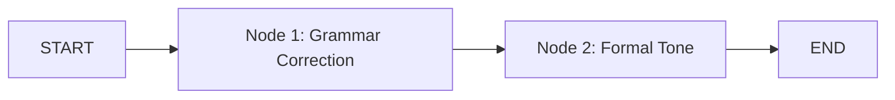

# AI-Text Processor

Este ejemplo demuestra cómo crear un pipeline de procesamiento de texto usando LangGraph y OpenAI para mejorar contenido en dos pasos:

1. Corrección gramatical
2. Ajuste de tono a formal

## Diagrama del Flujo



## Estado del Grafo

El grafo mantiene tres campos en su estado:

```typescript
{
    user_input: string,           // Texto original ingresado por el usuario
    gramatical_correction: string, // Texto después de la corrección gramatical
    graph_output: string          // Texto final con tono formal
}
```

## Nodos del Grafo

### Node 1: Corrección Gramatical

- **Entrada**: `state.user_input`
- **Proceso**: Utiliza GPT-4 para corregir errores gramaticales
- **Salida**: Actualiza `state.gramatical_correction`
- **Prompt**: "Correct the following text for grammatical errors: {text}"

### Node 2: Ajuste de Tono

- **Entrada**: `state.user_input`
- **Proceso**: Utiliza GPT-4 para ajustar el tono a formal
- **Salida**: Actualiza `state.graph_output`
- **Prompt**: "Adjust the tone of the following text to be more formal: {text}"

## Configuración Necesaria

1. Requiere un archivo `.env` con:

```
OPENAI_API_KEY=tu-api-key-aquí
```

2. Dependencias necesarias:

```json
{
  "@langchain/openai": "latest",
  "@langchain/langgraph": "latest",
  "@langchain/core": "latest"
}
```

## Ejemplo de Uso

```typescript
// Importar el handler
import { handler } from "./index";

// Ejecutar el grafo
await handler("hola amigo como estas");

// Ejemplo de salida:
// {
//   user_input: "hola amigo como estas",
//   gramatical_correction: "Hola amigo, ¿cómo estás?",
//   graph_output: "Saludos estimado, ¿cómo se encuentra usted?"
// }
```

## Detalles de Implementación

1. **Inicialización**:

   - Se configura el modelo OpenAI (GPT-4)
   - Se define el esquema del estado con anotaciones
   - Se crean los nodos del grafo

2. **Flujo de Datos**:

   ```
   START → node1 → node2 → END
   ```

3. **Manejo de Estado**:
   - Cada nodo recibe el estado completo
   - Las transformaciones son inmutables
   - Los resultados se acumulan en el estado
