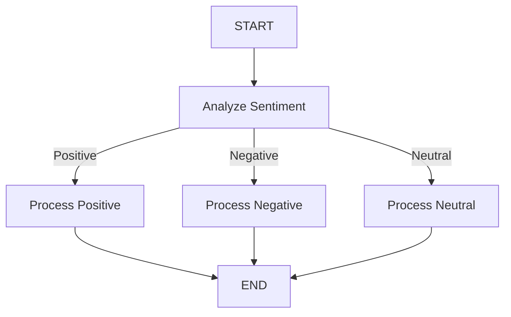

# Conditional Edge: Sentiment-Based Router

## 🎯 Reto

Construye un sistema de procesamiento de texto que analice el sentimiento del mensaje y proporcione respuestas personalizadas según la emoción detectada.

**Requisitos:**

- Crear un grafo usando LangGraph que implemente un router basado en el sentimiento del texto
- El sistema debe:
  1. Analizar si un texto es positivo, negativo o neutral
  2. Enrutar el texto al procesador adecuado según el sentimiento
  3. Generar una respuesta apropiada para cada tipo de sentimiento:
     - Textos positivos → Respuesta entusiasta
     - Textos negativos → Respuesta empática
     - Textos neutrales → Respuesta objetiva
- Implementar edges condicionales para el enrutamiento dinámico
- Mantener un estado que registre:
  - El texto original
  - El sentimiento detectado
  - Las respuestas generadas
  - La salida final

**Ejemplo de entrada/salida esperada:**

```typescript
// Entrada positiva
Input: "¡Me encanta este nuevo proyecto!"
Output: {
  user_input: "¡Me encanta este nuevo proyecto!",
  sentiment: "positive",
  graph_output: "¡Qué maravilloso ver tu entusiasmo! Tu energía positiva..."
}

// Entrada negativa
Input: "Me siento muy frustrado con estos errores."
Output: {
  user_input: "Me siento muy frustrado con estos errores.",
  sentiment: "negative",
  graph_output: "Entiendo tu frustración. Es normal sentirse así cuando..."
}
```

## Solución

Este ejemplo demuestra cómo usar edges condicionales en LangGraph para crear un router basado en sentimientos que procesa texto de manera diferente según su contenido emocional.

## 📊 Diagrama del Flujo



## 🔄 Estado del Grafo

```typescript
{
    user_input: string,           // Texto original del usuario
    sentiment: string,            // Resultado del análisis de sentimiento
    positive_response: string,    // Respuesta para texto positivo
    negative_response: string,    // Respuesta para texto negativo
    neutral_response: string,     // Respuesta para texto neutral
    graph_output: string         // Respuesta final seleccionada
}
```

## 🎯 Nodos del Grafo

### 1. Analyze Sentiment

- **Entrada**: `state.user_input`
- **Proceso**: Analiza el sentimiento del texto
- **Salida**: `sentiment` ('positive', 'negative', o 'neutral')

### 2. Process Positive

- **Entrada**: `state.user_input`
- **Proceso**: Genera una respuesta entusiasta
- **Salida**: `positive_response` y `graph_output`

### 3. Process Negative

- **Entrada**: `state.user_input`
- **Proceso**: Genera una respuesta empática
- **Salida**: `negative_response` y `graph_output`

### 4. Process Neutral

- **Entrada**: `state.user_input`
- **Proceso**: Genera una respuesta objetiva
- **Salida**: `neutral_response` y `graph_output`

## 🔀 Edge Condicional

La función `routeBySentiment` determina la ruta a seguir basada en el sentimiento, y luego el mapeo en `addConditionalEdges` traduce esa ruta al nodo correspondiente:

```typescript
// Función que determina la ruta lógica
const routeBySentiment = (state: typeof stateSchema.State) => {
  switch (state.sentiment) {
    case "positive":
      return "ROUTE_TO_POSITIVE";    // Identificador de ruta para contenido positivo
    case "negative":
      return "ROUTE_TO_NEGATIVE";    // Identificador de ruta para contenido negativo
    default:
      return "ROUTE_TO_NEUTRAL";     // Identificador de ruta para contenido neutral
  }
};

// Mapeo de rutas lógicas a nodos reales en addConditionalEdges
{
  ROUTE_TO_POSITIVE: "process_positive",  // Ruta positiva -> Nodo de procesamiento positivo
  ROUTE_TO_NEGATIVE: "process_negative",  // Ruta negativa -> Nodo de procesamiento negativo
  ROUTE_TO_NEUTRAL: "process_neutral"     // Ruta neutral -> Nodo de procesamiento neutral
}
```

## 📝 Ejemplo de Uso

```typescript
// Importar el handler
import { handler } from "./index";

// Ejemplo con texto positivo
await handler("¡Me encanta este nuevo proyecto!");
// Resultado: Respuesta entusiasta y motivadora

// Ejemplo con texto negativo
await handler("Me siento muy frustrado con estos errores.");
// Resultado: Respuesta empática y de apoyo

// Ejemplo con texto neutral
await handler("El cielo está nublado hoy.");
// Resultado: Respuesta objetiva y balanceada
```

## 🔑 Conceptos Clave

1. **Edge Condicional**:

   - Uso de `addConditionalEdges` para enrutamiento dinámico
   - Separación clara entre rutas lógicas (`ROUTE_TO_*`) y nodos destino (`process_*`)
   - Mapeo explícito de rutas a nodos para mejor mantenibilidad

2. **Estado Múltiple**:

   - Manejo de diferentes tipos de respuestas en el estado
   - Cada nodo actualiza su parte específica del estado

3. **Procesamiento Específico**:

   - Nodos especializados para cada tipo de sentimiento
   - Cada nodo tiene una responsabilidad única y clara

4. **Flujo Dinámico**:
   - El camino a través del grafo se determina en tiempo de ejecución
   - Las decisiones de enrutamiento se basan en el análisis del contenido

## 🛠️ Configuración Necesaria

1. Archivo `.env` con:

```
OPENAI_API_KEY=tu-api-key-aquí
```

2. Dependencias:

```json
{
  "@langchain/openai": "latest",
  "@langchain/langgraph": "latest",
  "@langchain/core": "latest"
}
```

Este ejemplo muestra cómo los edges condicionales permiten crear flujos de trabajo dinámicos que se adaptan al contenido del input, permitiendo respuestas más contextuales y apropiadas.
