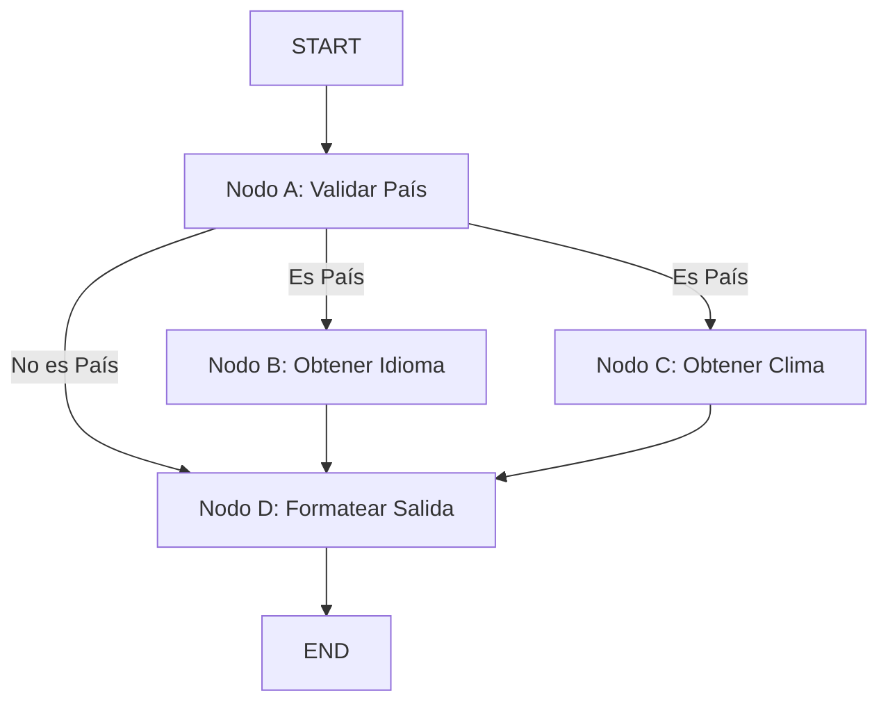

# 🚦 Nodos en Paralelo en LangGraph

## 🎯 Reto

Construye un sistema que demuestre la ejecución en paralelo de nodos en un grafo usando LangGraph. El sistema procesa información de países validando si la entrada es un país y luego obtiene información sobre el idioma y el clima en paralelo.

**Requisitos:**

- Crear un grafo usando LangGraph que implemente:
  1. Un nodo inicial que valide si la entrada es un país
  2. Nodos que se ejecuten en paralelo para obtener información del país
  3. Un nodo final que agregue los resultados
- El sistema debe:
  - Ejecutar nodos en paralelo cuando sea apropiado
  - Validar la entrada del país antes de procesar
  - Mantener actualizaciones de estado consistentes
- Implementar un estado que mantenga un registro de toda la información recopilada

**Ejemplo de entrada/salida:**

```typescript
// Entrada
Input: {
  user_input: "España",
  isCountry: undefined,
  language: undefined,
  weather: undefined,
  graph_output: undefined
}

// Salida esperada (el flujo interno debería):
// 1. Nodo A valida si la entrada es un país
// 2. Si es un país, los Nodos B y C se ejecutan en paralelo obteniendo idioma y clima
// 3. Nodo D combina los resultados
Output: {
  user_input: "España",
  isCountry: true,
  language: "Español",
  weather: "Soleado y cálido",
  graph_output: "El idioma de España es Español y el clima es Soleado y cálido"
}
```

## 📊 Diagrama de Flujo



## 🔄 Estado del Grafo

El estado mantiene información sobre el procesamiento del país:

```typescript
const stateSchema = Annotation.Root({
  user_input: Annotation<string>,
  isCountry: Annotation<boolean>,
  language: Annotation<string>,
  weather: Annotation<string>,
  graph_output: Annotation<string>,
});
```

## 🎯 Nodos del Grafo

### 1. Nodo A (Validación de País)

- **Función**: Valida si la entrada es un país
- **Entrada**: Texto de entrada del usuario
- **Salida**: Booleano indicando si es un país
- **Ejemplo**:
  ```typescript
  return { isCountry: true };
  ```

### 2. Nodo B (Idioma) y C (Clima) - Paralelos

- **Función**: Se ejecutan simultáneamente para obtener información del país
- **Entrada**: Estado después de la validación del país
- **Salida**: Información de idioma y clima respectivamente
- **Ejemplo**:
  ```typescript
  // Nodo B
  return { language: "Español" };
  // Nodo C
  return { weather: "Soleado" };
  ```

### 3. Nodo D (Agregación)

- **Función**: Combina toda la información en una salida legible
- **Entrada**: Estado con toda la información del país
- **Salida**: Cadena de texto formateada
- **Ejemplo**:
  ```typescript
  return {
    graph_output: "El idioma de España es Español y el clima es Soleado",
  };
  ```

## 🔀 Manejo de Bordes Condicionales

El grafo utiliza bordes condicionales para controlar el flujo:

1. Si la entrada es un país, ejecuta los nodos de idioma y clima en paralelo
2. Si la entrada no es un país, va directamente al nodo de salida
3. Los resultados se combinan en el nodo final independientemente del camino tomado

## 📝 Ejemplo de Uso

```typescript
import { StateGraph, Annotation } from "@langchain/langgraph";
import { ChatOpenAI } from "@langchain/openai";
import { PromptTemplate } from "@langchain/core/prompts";

// Crear la instancia del modelo
const model = new ChatOpenAI({
  model: "gpt-4-mini",
  apiKey: process.env.OPENAI_API_KEY,
});

// Definir el esquema de estado
const stateSchema = Annotation.Root({
  user_input: Annotation<string>,
  isCountry: Annotation<boolean>,
  language: Annotation<string>,
  weather: Annotation<string>,
  graph_output: Annotation<string>,
});

// Crear y configurar el grafo
const graph = new StateGraph(stateSchema)
  .addNode("a", nodeA)
  .addNode("b", nodeB)
  .addNode("c", nodeC)
  .addNode("d", nodeD)
  .addEdge(START, "a")
  .addConditionalEdges("a", validateCountry, ["b", "c", "d"])
  .addEdge("b", "d")
  .addEdge("c", "d")
  .addEdge("d", END)
  .compile();

// Ejecutar el grafo
const result = await graph.invoke({ user_input: "España" });
```

## 🛠️ Configuración Necesaria

1. Dependencias:

```json
{
  "@langchain/langgraph": "latest",
  "@langchain/core": "latest",
  "@langchain/openai": "latest"
}
```

Este ejemplo demuestra cómo implementar la ejecución en paralelo de nodos en LangGraph mientras se procesa información de países, mostrando flujos condicionales y gestión de estado en una aplicación práctica.
