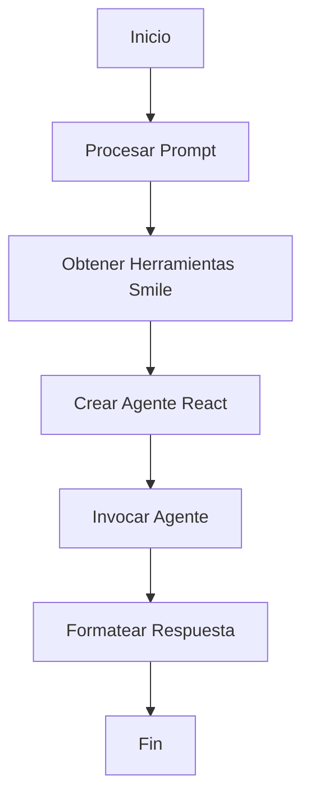

# 🎨 Agente Smile UI en LangGraph

## 🎯 Reto

Construye un agente utilizando LangGraph que interactúe con la biblioteca Smile UI para generar documentación y ejemplos de código. El agente debe ser capaz de responder preguntas sobre componentes y generar respuestas estructuradas.

**Requisitos:**

- Crear un agente usando LangGraph que:
  1. Utilice el modelo ChatOpenAI para procesar consultas
  2. Integre herramientas de la biblioteca Smile UI
  3. Genere respuestas estructuradas en español
- El sistema debe:
  - Procesar preguntas sobre componentes Smile UI
  - Generar respuestas con título, descripción y código
  - Mantener un formato consistente en español formal
- Implementar un esquema de respuesta que incluya título, descripción y código

**Ejemplo de entrada/salida:**

```typescript
// Entrada
Input: {
  messages: [{
    role: "user",
    content: "Explicame como funciona el SModal"
  }]
}

// Salida esperada
Output: {
  title: "Implementación del Componente Modal en Smile UI",
  description: "Análisis detallado del funcionamiento del componente SModal",
  code: "// Código de ejemplo del SModal"
}
```

## 📊 Diagrama de Flujo



## 🔄 Esquema de Respuesta

El formato de respuesta está definido por un esquema Zod:

```typescript
const responseFormatter = () => {
  return z.object({
    title: z.string().describe("Titulo del codigo"),
    description: z.string().describe("Descripcion del codigo"),
    code: z.string().describe("Codigo"),
  });
};
```

## 🎯 Componentes Principales

### 1. Configuración del Modelo

- **Función**: Inicializa el modelo de lenguaje
- **Configuración**: Utiliza GPT-4
- **Ejemplo**:
  ```typescript
  const model = new ChatOpenAI({
    model: "gpt-4o-mini",
    apiKey: process.env.OPENAI_API_KEY,
  });
  ```

### 2. Herramientas Smile UI

- **Función**: Obtiene las herramientas disponibles de Smile UI
- **Implementación**: Utiliza un cliente MCP personalizado
- **Ejemplo**:
  ```typescript
  const tools = await client.getTools();
  ```

### 3. Agente React

- **Función**: Crea y configura el agente React
- **Características**:
  - Integra el modelo LLM
  - Incorpora herramientas Smile UI
  - Define formato de respuesta
- **Ejemplo**:
  ```typescript
  const agent = createReactAgent({
    llm: model,
    tools,
    responseFormat: {
      prompt: `El title y description deben ser en español en un todo extremadamente formal`,
      schema: responseFormatter(),
    },
  });
  ```

## 📝 Ejemplo de Uso

```typescript
import { ChatOpenAI } from "@langchain/openai";
import { createReactAgent } from "@langchain/langgraph/prebuilt";
import { z } from "zod";
import client from "./mcp";

// Configurar el prompt
const prompt = `Explicame como funciona el SModal`;

// Crear y ejecutar el agente
const handler = async () => {
  const messages = [{ role: "user", content: prompt }];
  const model = new ChatOpenAI({
    /*...*/
  });
  const tools = await client.getTools();
  const agent = createReactAgent({
    /*...*/
  });

  const result = await agent.invoke({ messages });
  return result.structuredResponse;
};
```

## 🛠️ Configuración Necesaria

1. Dependencias:

```json
{
  "@langchain/openai": "latest",
  "@langchain/langgraph": "latest",
  "zod": "latest"
}
```

2. Variables de Entorno:

```env
OPENAI_API_KEY=tu-api-key
```

Este ejemplo demuestra cómo implementar un agente React con LangGraph que interactúa con la biblioteca Smile UI, procesando consultas y generando respuestas estructuradas en español formal.
