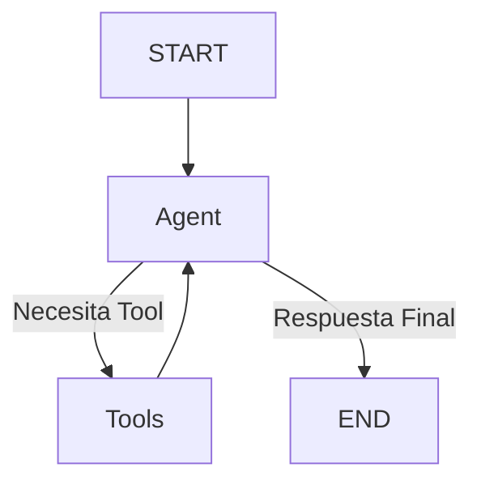

# Tool Node: Weather Information System

## 🎯 Reto

Construye un sistema conversacional que utilice herramientas (tools) para obtener información del clima. El sistema debe ser capaz de interpretar preguntas sobre el clima, obtener códigos de ciudad y consultar el clima usando esos códigos.

**Requisitos:**

- Crear un grafo usando LangGraph que implemente:
  1. Un agente que pueda entender preguntas sobre el clima
  2. Herramientas (tools) para:
     - Obtener el código de una ciudad
     - Consultar el clima usando el código de la ciudad
  3. Un sistema de enrutamiento que decida cuándo usar las herramientas
- El sistema debe:
  - Procesar mensajes del usuario
  - Identificar cuando necesita usar una herramienta
  - Llamar a la herramienta apropiada
  - Continuar la conversación hasta obtener una respuesta final
- Implementar un estado basado en mensajes que mantenga el contexto de la conversación

**Ejemplo de entrada/salida esperada:**

```typescript
// Entrada
Input: [
  {
    role: "user",
    content: "¿Cuál es el clima en San Francisco?",
  },
];

// Salida esperada (el flujo interno debería):
// 1. Identificar que necesita el código de San Francisco
// 2. Usar get_code_for_cities para obtener "SF"
// 3. Usar get_weather para consultar el clima con "SF"
// 4. Retornar la respuesta final
Output: {
  messages: [
    { role: "user", content: "¿Cuál es el clima en San Francisco?" },
    { role: "assistant", content: "It's 60 degrees and foggy." },
  ];
}
```

## Solución

Este ejemplo demuestra cómo crear un grafo que utiliza herramientas (tools) para procesar consultas sobre el clima, implementando un flujo conversacional que puede tomar decisiones sobre cuándo usar cada herramienta.

## 📊 Diagrama del Flujo



## 🔄 Estado del Grafo

El estado se basa en `MessagesAnnotation`, que mantiene un array de mensajes con la siguiente estructura:

```typescript
{
  messages: [
    { role: "user", content: string },
    { role: "assistant", content: string },
    { role: "tool", content: string },
  ];
}
```

## 🛠️ Herramientas Disponibles

### 1. get_weather

- **Función**: Obtener el clima actual de una ciudad
- **Input**: Código de la ciudad
- **Output**: Descripción del clima
- **Ejemplo**:
  ```typescript
  Input: {
    code: "SF";
  }
  Output: "It's 60 degrees and foggy.";
  ```

### 2. get_code_for_cities

- **Función**: Obtener el código de una ciudad
- **Input**: Nombre de la ciudad
- **Output**: Código de la ciudad
- **Ejemplo**:
  ```typescript
  Input: {
    city: "San Francisco";
  }
  Output: "SF";
  ```

## 🎯 Nodos del Grafo

### 1. Agent Node (callModel)

- **Función**: Procesa los mensajes y decide si necesita usar herramientas
- **Input**: Estado actual de mensajes
- **Output**: Respuesta o llamada a herramienta

### 2. Tool Node

- **Función**: Ejecuta las herramientas solicitadas
- **Input**: Llamada a herramienta del agente
- **Output**: Resultado de la herramienta

## 🔀 Edge Condicional

La función `shouldContinue` determina si:

- Se necesita usar una herramienta → ruta a "tools"
- Se tiene una respuesta final → ruta a END

```typescript
const shouldContinue = (state) => {
  // Si el último mensaje tiene tool_calls
  if (lastMessage.tool_calls?.length) {
    return "tools";
  }
  return END;
};
```

## 📝 Ejemplo de Uso

```typescript
import { handler } from "./index";

// Consultar el clima
await handler([
  {
    role: "user",
    content: "¿Cuál es el clima en San Francisco?",
  },
]);

// Consultar otra ciudad
await handler([
  {
    role: "user",
    content: "¿Qué temperatura hace en Nueva York?",
  },
]);
```

## 🛠️ Configuración Necesaria

1. Archivo `.env` con:

```
OPENAI_API_KEY=tu-api-key-aquí
```

2. Dependencias:

```json
{
  "@langchain/openai": "latest",
  "@langchain/langgraph": "latest",
  "@langchain/core": "latest",
  "zod": "latest"
}
```

Este ejemplo muestra cómo integrar herramientas externas en un flujo conversacional usando LangGraph, permitiendo que el sistema tome decisiones sobre cuándo y qué herramientas usar para responder preguntas del usuario.
