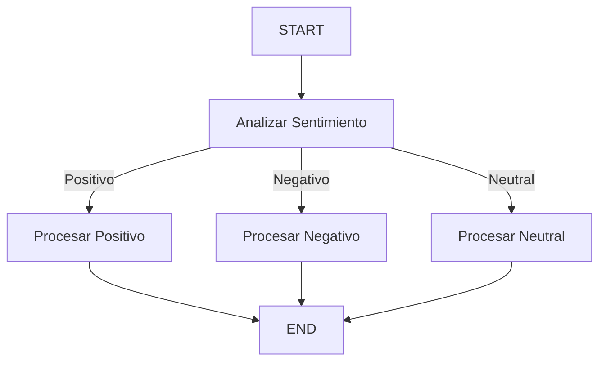

# 🎮 Commands en LangGraph.js

## 🎯 ¿Qué es un Command?

Un Command en LangGraph.js es una estructura especial que permite combinar dos aspectos fundamentales en un grafo:

1. **Control de flujo** (routing dinámico entre nodos)
2. **Actualizaciones de estado** (modificación del estado del grafo)

Es como un director de orquesta que no solo toca la música (actualiza el estado) sino que también decide qué músico toca después (controla el flujo).

## 🔑 Estructura Básica

```typescript
new Command({
  update: {
    /* actualizaciones del estado */
  },
  goto: "nombreDelSiguienteNodo",
  graph: Command.PARENT, // opcional, para navegar a nodos en grafos padres
});
```

## 🎯 Reto: Analizador de Sentimientos con Respuestas Personalizadas

Construye un sistema que analice el sentimiento de un texto y genere respuestas personalizadas basadas en el análisis utilizando Commands para el control de flujo.

**Requisitos:**

- Crear un grafo usando LangGraph que implemente:
  1. Un nodo que analice el sentimiento del texto (positivo, negativo, neutral)
  2. Nodos específicos para generar respuestas según el sentimiento
  3. Control de flujo dinámico usando Commands
- El sistema debe:
  - Analizar correctamente el sentimiento del texto
  - Enrutar dinámicamente a diferentes procesadores según el sentimiento
  - Generar respuestas apropiadas según el contexto
  - Mantener un estado consistente

**Ejemplo de entrada/salida:**

```typescript
// Entrada
Input: {
  user_input: "¡Me encanta programar en TypeScript!",
  sentiment: undefined,
  positive_response: undefined,
  negative_response: undefined,
  neutral_response: undefined,
  graph_output: undefined
}

// Salida esperada
Output: {
  user_input: "¡Me encanta programar en TypeScript!",
  sentiment: "positive",
  positive_response: "¡Es fantástico ver tu entusiasmo por TypeScript! Tu pasión por la programación es inspiradora.",
  negative_response: undefined,
  neutral_response: undefined,
  graph_output: "¡Es fantástico ver tu entusiasmo por TypeScript! Tu pasión por la programación es inspiradora."
}
```

## 📊 Diagrama de Flujo



## 🔄 Estado del Grafo

El estado mantiene información sobre el análisis y las respuestas:

```typescript
const stateSchema = Annotation.Root({
  user_input: Annotation<string>,
  sentiment: Annotation<string>,
  positive_response: Annotation<string>,
  negative_response: Annotation<string>,
  neutral_response: Annotation<string>,
  graph_output: Annotation<string>,
});
```

## 🎯 Nodos del Grafo

### 1. Nodo Analyze Sentiment

- **Función**: Analiza el sentimiento del texto de entrada
- **Usa Command para**:
  - Actualizar el estado con el sentimiento detectado
  - Enrutar al nodo de procesamiento apropiado
- **Ejemplo**:
  ```typescript
  return new Command({
    update: { sentiment: "positive" },
    goto: "process_positive",
  });
  ```

### 2. Nodos de Procesamiento (Positive, Negative, Neutral)

- **Función**: Generan respuestas específicas según el sentimiento
- **Salida**: Actualizan el estado con la respuesta generada
- **Ejemplo**:
  ```typescript
  return {
    positive_response: "¡Respuesta entusiasta!",
    graph_output: "¡Respuesta entusiasta!",
  };
  ```

## 📝 Implementación de Ejemplo

```typescript
import {
  Annotation,
  START,
  StateGraph,
  END,
  Command,
} from "@langchain/langgraph";
import { ChatOpenAI } from "@langchain/openai";
import { PromptTemplate } from "@langchain/core/prompts";
import { HumanMessage } from "@langchain/core/messages";

// Configuración del modelo
const model = new ChatOpenAI({
  model: "gpt-4-mini",
  apiKey: process.env.OPENAI_API_KEY,
});

// Handler principal
export const handler = async (text: string) => {
  // Definición del estado y nodos...
  // [Ver el código completo en index.ts]
};
```

## 🛠️ Configuración Necesaria

1. Dependencias:

```json
{
  "@langchain/langgraph": "latest",
  "@langchain/core": "latest",
  "@langchain/openai": "latest"
}
```

## 💡 Puntos Clave sobre Commands

1. **Flexibilidad**: Los Commands permiten tomar decisiones dinámicas sobre el flujo del grafo
2. **Estado Consistente**: Combinan actualizaciones de estado con control de flujo
3. **Claridad**: Hacen el código más legible al centralizar la lógica de routing
4. **Escalabilidad**: Facilitan la adición de nuevas rutas y comportamientos

## 🎓 Consejos de Implementación

1. **Usa Commands cuando necesites**:

   - Routing dinámico basado en el estado
   - Combinar actualizaciones de estado con decisiones de flujo
   - Navegar entre subgrafos

2. **Mejores Prácticas**:
   - Define claramente los posibles destinos en `ends`
   - Mantén la lógica de routing simple y clara
   - Documenta las condiciones de routing

Este ejemplo demuestra cómo usar Commands en LangGraph.js para crear un sistema de análisis de sentimientos con routing dinámico y respuestas personalizadas, mostrando la potencia y flexibilidad de esta característica.
